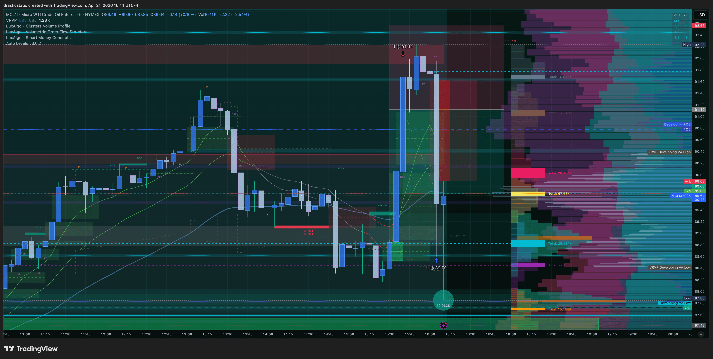

# Trade Review — MCL SHORT | Apr 21, 2026
### 20260421_MCL-APEX_001 · Account: APEX-484839-06 · Trade #001 of Apr 21

[Jump to 📝 Notes for Coaches ↓](#notes-for-coaches)

---

## ⚡ What Happened in One Paragraph

Late-session SHORT on MCLM6 (Micro WTI Crude Oil) entered via a limit order set at 15:27 ET and filled at 15:42 at 91.11 — 18 minutes before the 16:00 cash close. Christopher had been placing and canceling limit brackets across NQ, ES, YM, and RTY throughout the day with no fills; the MCL short was the idea that finally triggered. A SL at 96.25 ($514 risk) was placed 25 seconds after fill, then canceled. Price moved immediately adverse to 92.23 (-$112 MAE) before reversing sharply below entry. A TP limit at 89.72 was set at 15:58 and filled at 89.70 at 16:09, netting **+$141.00**. Exit efficiency was 43.25% — price continued to 88.63 (MFE) just one minute later. After the trade closed, Christopher placed additional MCLM6 orders (buy limit 90.78, sell limit 95.45) which were both canceled. Pattern 7 active throughout.

---

## 📊 Trade Data

| Field | Value |
|-------|-------|
| **Account** | APEX-484839-06 |
| **Platform** | Apex Trader Funding |
| **Instrument** | MCL (Micro WTI Crude Oil, $100/point) |
| **Contract** | MCLM6 (June 2026) |
| **Direction** | SHORT |
| **Entry Price** | 91.11 |
| **Exit Price** | 89.70 |
| **Qty** | 1 micro |
| **Entry Time** | 15:42:04 ET, Apr 21, 2026 |
| **Exit Time** | 16:09:48 ET, Apr 21, 2026 |
| **Duration** | ~27.7 min |
| **Order Set** | Limit set 15:27:35 ET (same session) |
| **Playbook** | ZTH \| Pivot — pivot sell |
| **Venue** | TradingView → Tradovate |
| **SL Set / Result** | 96.25 (set 15:42:29) → ❌ Canceled in-trade — $514 theoretical risk |
| **TP Set / Result** | 89.72 limit (set 15:58:15) → ✅ Filled at 89.70 |
| **MAE** | 92.23 = **-$112** |
| **MFE** | 88.63 = **+$248** |
| **Best Exit** | 87.85 at 16:10 ET |
| **Exit Efficiency** | 43.25% |
| **Points** | 1.41 |
| **Gross P&L** | **+$141.00** |
| **Net P&L** | **+$141.00** |
| **Realized R:R** | N/A — no structural SL held at exit |
| **Zella Score** | 56.85 |
| **Rating** | 2.5/5 |
| **Emotionally Stable** | No (calm entering; fearful, anxious in-trade) |

---

## 📋 Order Execution

**MCL orders — MCLM6 (all other instruments canceled, no fills):**

| Time (ET) | B/S | Contract | Type | Price | Fill Price | Status | Notes |
|-----------|-----|---------|------|-------|-----------|--------|-------|
| 15:27:35 | Sell | MCLM6 | Limit | 91.11 | — | Resting | Entry limit set |
| **15:42:04** | **Sell** | **MCLM6** | **Limit** | **91.11** | **91.11** | **✅ Filled** | **Entry** |
| 15:42:29 | Buy | MCLM6 | Stop | 96.25 | — | ❌ Canceled | Initial SL ($514 risk) — canceled in-trade |
| 15:58:15 | Buy | MCLM6 | Limit | 89.72 | — | Resting | TP set while trade in progress |
| **16:09:48** | **Buy** | **MCLM6** | **Limit** | **89.72** | **89.70** | **✅ Filled** | **Exit — $0.02 better than limit** |
| 16:24:33 | Buy | MCLM6 | Limit | 90.78 | — | ❌ Canceled | Post-exit re-entry idea |
| 16:33:15 | Sell | MCLM6 | Limit | 95.45 | — | ❌ Canceled | Post-exit short idea |

**Also canceled (no fills) — Apr 20–21:**
NQM6 × 6 orders, ESM6 × 3, YMM6 × 5, RTYM6 × 5 — all brackets canceled throughout the day.

---

## 📖 Session Narrative

Monday Apr 21 was a full trading day for Christopher across APEX-484839-06, with extensive limit bracket activity across NQ, ES, YM, and RTY that produced no fills. Overnight NQ brackets (Apr 20, ~21:48–22:03 ET) were the first activity — both canceled before the open. During the NY session, multiple brackets were placed and removed across all four major index instruments between 6:11 AM and 15:54 ET. None triggered.

As the session approached close, attention shifted to MCL. The short limit at 91.11 was set at 15:27 — 33 minutes before the 16:00 close, with the APEX 16:58 hard stop as the final backstop. The thesis was ZTH Pivot sell: indices showing resting liquidity zones that aligned with energy's downside. The limit filled at 15:42. Price immediately ran adverse to 92.23 before the seller pressure that Christopher anticipated arrived — price fell sharply through entry and toward the TP.

After exit, Christopher placed two more MCLM6 orders (a re-entry long at 90.78 and another short at 95.45) — both placed in the 16:24–16:33 window and canceled. These post-exit orders are consistent with the "many orders on each indices charts" pattern: broad scanning rather than single-plan execution.

No premarket summary was created for Apr 21.

---

## 📸 Screenshot Timeline

**16:14 ET — MCL SHORT just after exit**

**16:17 ET — Post-exit, reviewing the move**

---

## 📝 Notes for Coaches + SmartTraderAI

> *"It was a last minute idea with many orders I planned on each indices charts, I almost exited in the red but wow the market quickly secured profit as I moved TP into a place I hoped to at least see a green day for a change :-)"*

The tradovate CSV tells a fuller story than "last minute." The limit was set 33 minutes before fill — more planned than impulse. But 32 other orders across 5 instruments were placed and canceled the same day, suggesting this wasn't a clean setup-first execution. The MCL short was the one that triggered out of a broad net.

The SL is the most significant data point in the entire order log: 96.25 was set 25 seconds after fill — $514 theoretical risk on a trade that exited at +$141. That SL was never going to be honored. It was placed and canceled within the same emotional window. The "variable SL" description in post-trade notes is accurate, but the CSV reveals the mechanics: a wide SL set as a gesture toward protection, then removed when price moved against the position.

The 43.25% exit efficiency is the Pattern 8 signature. Price continued 1.21 points further after exit. The TP at 89.72 was set while in the MAE — it was likely placed at a level that felt like "just get to green" rather than a structural target. When it hit, Christopher took it.

Post-exit orders (90.78 re-entry, 95.45 short) placed 15–24 minutes after close are worth noting with ZTH coach. The trade was closed profitably but the account wasn't shut down. Additional MCLM6 activity after exit suggests unsettled state — potentially looking for another entry rather than logging the win and stepping away.

**The win here is real and meaningful.** First profitable MCL exit, active management, green day. The question for coaching is whether the process that produced this win is repeatable or whether it required price to rescue a broken setup.

---

## 🧠 Behavioral Notes

**Pattern 7 (SL modification) — active:** SL set at 96.25 ($514 risk), canceled in-trade during the MAE. TP placement and eventual exit price were managed emotionally rather than mechanically.

**Pattern 8 (exit passivity) — partial improvement:** First profitable active MCL exit. TP limit was pre-set (not a market order panic exit). However, the TP was placed during adverse movement at a "just get to green" level rather than a structural target. Exit efficiency 43.25%.

**"Almost exited in the red":** The MAE to 92.23 triggered active consideration of early exit. This confirms the emotional state during the trade — not calm management, reactivity to P&L. The outcome was positive because price reversed, not because of a plan.

**Post-exit orders:** Two additional MCLM6 orders after close is a Pattern 9 flag — desk hygiene after a profitable exit includes stepping away, not scanning for the next entry.

**What went right:** Index liquidity read was directionally correct. TP limit was pre-set before fill (placed at 15:58, filled 16:09 — it wasn't a panic exit). 1 micro contract contained the downside. Green day achieved.

| Pattern | Status | This Trade |
|---------|--------|------------|
| Pattern 7 (SL modification) | 🔴 Active | 96.25 SL set then canceled in-trade — $514 theoretical risk abandoned |
| Pattern 8 (exit passivity) | 🟡 Partial improvement | TP pre-set ✅ — but at emotional level, 43.25% efficiency |
| Pattern 9 (order hygiene) | 🟡 Monitoring | Post-exit MCLM6 orders placed 15–24 min after close |

---

## 🔁 Pattern Tracker

Trade 20260421_MCL-APEX_001 logged.

> See full running progress tracker (all sessions, behavioral arc, compliance scores, statistical summary): [../../pattern_tracker.md](../../pattern_tracker.md)

First profitable MCL trade on APEX-06 with an active exit. The SL cancellation data from Tradovate reveals the full Pattern 7 mechanics — this is the first review where the CSV documents the exact SL-set-then-removed sequence in timestamps.

---

## 🎯 Forward Focus

1. **SL discipline before TP:** The 96.25 SL was set and immediately abandoned. If the SL level felt wrong, the correct response is to not enter — not to remove it after fill. Write the SL level before setting the entry limit. If it can't be written, the trade isn't ready.
2. **TP at a level, not a P&L state:** "Just get to green" is not a TP. Identify a structural level (prior support, session low, round number) before the trade is live. The TP limit pre-set is positive — the level selection needs to be structural.
3. **Shut down after exit:** Two post-exit MCLM6 orders on a winning trade. After a profitable close near session end, log the trade and close the platform. The next trade should start at the next session's premarket, not 15 minutes after the last fill.

---

> See full trade review: https://github.com/drasticstatic/trading-assistant-public-preview/blob/main/smarttrader-ai/reviews/2026/04-Apr/review_20260421_MCL-APEX_001.md

---

*Produced with 🙏🏼 Fortuna — Wealth Warden | Claude Code CLI*
*Trade Review — MCL SHORT · Apr 21, 2026 · 20260421_MCL-APEX_001*
