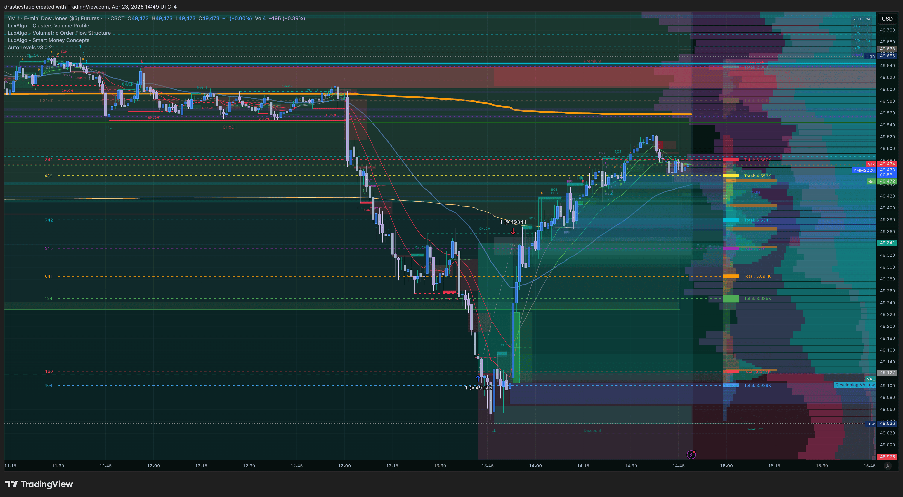
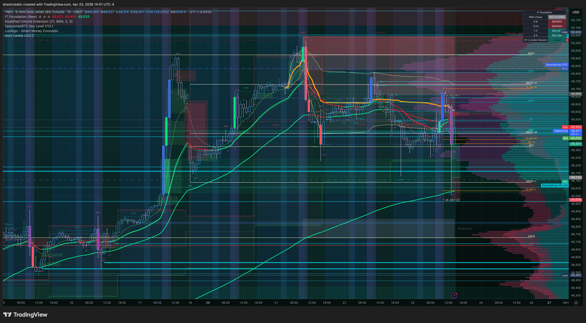

# 🔍 Trade Review — YM Long · APEX-06 · Thu, Apr 23, 2026
### 20260423_YM-APEX_002 · +$1,095.00 · ZTH SFP bracket · TP filled · Zella 95.22

[Jump to 📝 Notes for Coaches ↓](#notes-for-coaches)

---

## ⚡ What Happened in One Paragraph

As part of the same multi-instrument bracket strategy that produced the RTY fill, Christopher had a limit order sitting at 49122 on YM — a level he described as one he did not expect to get hit. The market swept aggressively lower on April 23, and while Christopher was already managing the RTY position (filled at 13:09), he heard the YM order fill sound at 13:42 ET. For a moment both positions were against him simultaneously, and the account seemed at risk. But the reversal came sharply and the YM trade moved cleanly to profit. Christopher had originally placed a TP at 50000 (from an earlier bracket attempt at 49549 entry), but with the account pressure of the simultaneous RTY loss, he modified the TP down to 49341 to "be grateful for the win" and ensure capture. It filled at 13:53 ET — just 11 minutes after entry — for +$1,095. This trade single-handedly funded the rest of the afternoon's RTY mitigation and turned the session green.

---

## 📊 Trade Data

| Field | Value |
|-------|-------|
| Account | Tradovate APEX 100K FULL — APEX-484839-06 |
| Platform | Apex Trader Funding |
| Instrument | YM (E-Mini Dow $5) |
| Contract | YMM6 |
| Direction | Long |
| Entry Price | 49,122 |
| Exit Price | 49,341 (TP filled) |
| Qty | 1 |
| Entry Time | 13:42:13 EDT |
| Exit Time | 13:53:31 EDT |
| Duration | 11m 18s |
| Order Set | Limit placed 11:10:28 ET, filled 13:42:13 ET (~2.5hr wait) |
| Venue | TradingView |
| TP Set / Result | Modified from original sweep bracket → 49,341 — **filled** |
| SL Set / Result | 48,601 placed 13:47 ET — canceled when TP filled |
| MFE | +$1,150 · +230 pts · @49,352 |
| MAE | -$430 · -86 pts · @49,036 |
| Best Exit | +$2,025 · +405 pts · @49,527 (54.07% exit efficiency) |
| Gross P&L | +$1,095 |
| Net P&L | **+$1,095** |
| Realized R:R | 0.42R (219 pts captured / 521 pts at risk vs SL 48,601) |
| Zella Score | 95.22 |
| Rating | 4.0 / 5 |
| Emotionally Stable | Yes |

---

## 📋 Order Execution

| Time (ET) | Order | Instrument | Price | Status |
|-----------|-------|-----------|-------|--------|
| 04/23 10:20:17 | Buy Limit | YM | 49,549 | Canceled — earlier higher entry attempt |
| 04/23 10:20:44 | Sell Limit | YM | 50,000 | Canceled — bracket TP for prior entry attempt |
| **11:10:28** | **Buy Limit placed** | **YM** | **49,122** | — |
| **13:42:13** | **Buy Limit** | **YM** | **49,122** | **FILLED — ENTRY** |
| 13:47:22 | Sell Stop | YM | 48,601 | Placed — SL |
| **13:49:08** | **Sell Limit placed** | **YM** | **49,341** | **TP (modified down from original sweep level)** |
| **13:53:31** | **Sell Limit** | **YM** | **49,341** | **FILLED — TP HIT** |
| — | Sell Stop | YM | 48,601 | Canceled — auto-canceled on TP fill |

---

## 📖 Session Narrative

The YM long at 49122 was the second fill of the day and — despite being smaller in scope than the original TP target — the trade that defined the session. Christopher had set the limit at 49122 during an earlier period in the session after a prior entry attempt at 49549 was canceled. The level was chosen on the same thesis as RTY: ZTH SFP + advanced structure entry at an OB/FVG confluence zone, targeting a manipulation sweep reversal.

The wait was about 2.5 hours from order placement to fill. When the fill came at 13:42, Christopher was already in the RTY trade (entered at 13:09) which was in significant adverse territory. Having two simultaneously losing positions, both during an aggressive move lower, created real psychological pressure — Christopher described thinking the account was going to blow. This is notable: the emotional state at the YM fill was acute stress, yet the YM trade itself executed cleanly.

The reversal from the sweep low was sharp. YM moved to 49352 (MFE +$1,150) and ultimately to 49527 (best theoretical exit +$2,025). Christopher, managing account risk in real time with RTY still open and negative, modified his TP down from the original sweep target to 49341 — described in his notes as "moving TP to be grateful for the win." The TP hit at 13:53, 11 minutes after entry. The realized exit efficiency was 54.07% — meaningful but well below the best exit, with 46 pts of additional move left on the table.

The cross-instrument dynamic is worth flagging: this setup had characteristics of a TCL (Trap Candle Long) across two indices simultaneously — both RTY and YM sweeping to key ZTH levels at roughly the same time and recovering together. Christopher noted this felt like a cross-instrument TCL, consistent with ZTH + IT confluence methodology applied to index SMT relationships.

No formal pre-market plan was on file for this session.

---

## 📸 Screenshot Timeline

**14:49 ET — YM post-trade chart review (entry zone and TP fill)**

**14:51 ET — YM sweep context and full move detail**

---

## 📝 Notes for Coaches + SmartTraderAI

> "this was a limit order i did not expect to get hit but it saved the day :-), i have been setting limits far out recently and mostly sitting on my hands observing the recent manipulation come close to our limits on these bigger moves nervous to get stopped on smaller trade ideas but today we got hit strong lol"

The YM trade is architecturally close to an A+ entry: ZTH SFP setup, valid level, patient entry, limit placed well in advance, and price confirmed the thesis with a sharp reversal. The 95.22 Zella Score reflects strong execution quality at entry. The TP modification from the original sweep target down to 49341 is the primary coaching point — not because the modification was wrong in isolation, but because the motivation was account-level stress rather than pure trade logic.

The realized R:R of 0.42R (captured 219 pts against 521 pts at risk) is technically sub-1R on the filed numbers — though the original TP at 50000 would have delivered 1.69R. Christopher was managing real-time account equity pressure from the simultaneous RTY loss, which is a legitimate context for risk reduction. However, the pattern of TP modification ("moved tp" listed under Mistakes in TradeZella) is a recurring theme across the journal and represents the flip side of Pattern 7: adjusting TP downward to lock in a smaller win is emotionally identical to adjusting SL to avoid a defined loss — both are in-flight changes driven by comfort rather than pre-defined plan.

The "overtrade?" flag in Mistakes is also worth discussing. Christopher noted this may have been a justified overtrade because the setup evolved into an IT-TCL structure. That read is consistent with the cross-instrument sweep context — but the qualification is important: when two instruments sweep simultaneously to key levels, that confluence should be identified pre-session, not post-fill.

**Coaching recommendation:** Pre-define the TP level as part of the bracket setup at order placement time. If account pressure from a concurrent position influences exit logic, that is an emotional input — log it and hold the original TP. A modified TP is a silent form of Pattern 7.

---

## 🧠 Behavioral Notes

- **Entry emotion:** Calm, excited, confident, neutral, happy
- **In-trade emotion:** Stress from concurrent RTY adverse position
- **Emotionally stable:** Yes
- **What went right:** Patient limit entry 2.5 hours before fill; clean reversal from the sweep; TP filled before AutoLiq; YM trade absorbed RTY loss and made the session green; cross-instrument awareness (RTY + YM simultaneous sweep read)

| Pattern | Status | This Trade |
|---------|--------|-----------|
| Pattern 7 — SL modification | 🔴 Active | TP modified down from sweep target to 49,341 (pressure-driven) |
| Pattern 8 — Exit passivity | ✅ Not triggered | TP filled actively at 13:53 — no passive hold |
| Pattern 9 — Pre-rest order hygiene | ✅ N/A | Trade closed within 11 min of entry |

---

## 🔁 Pattern Tracker

Trade 20260423_YM-APEX_002 logged.

> See full running progress tracker (all sessions, behavioral arc, compliance scores, statistical summary): [../../pattern_tracker.md](../../pattern_tracker.md)

Pattern 8 absent here — this is the cleanest exit of the recent arc. TP hit actively, SL was in place and canceled cleanly on TP fill. The TP modification is a softer Pattern 7 expression — worth flagging but not the same severity as SL cancellation.

---

## 🎯 Forward Focus

1. **Log the pre-planned TP level at bracket setup.** When placing a limit order, record the intended TP in the bracket immediately. If price reaches the entry and account pressure influences the TP, the original level is logged and the deviation is visible.
2. **Cross-instrument sweeps are pre-session setups, not in-session discoveries.** When RTY and YM are both near ZTH key levels simultaneously, flag that in the pre-market plan as a potential dual-fill scenario.
3. **A sub-1R win is still a win — but don't accept it as the standard.** This trade was profitable. The original target offered 1.69R. Pre-plan captures the full move; in-trade modification cuts it.

---

> See full trade review: https://github.com/drasticstatic/trading-assistant-public-preview/blob/main/smarttrader-ai/reviews/2026/04-Apr/review_20260423_YM-APEX_002.md

---

*Produced with 🙏🏼 Fortuna — Wealth Warden | Claude Code CLI*
*Trade Review — YM Long · April 23, 2026 · 20260423_YM-APEX_002*
