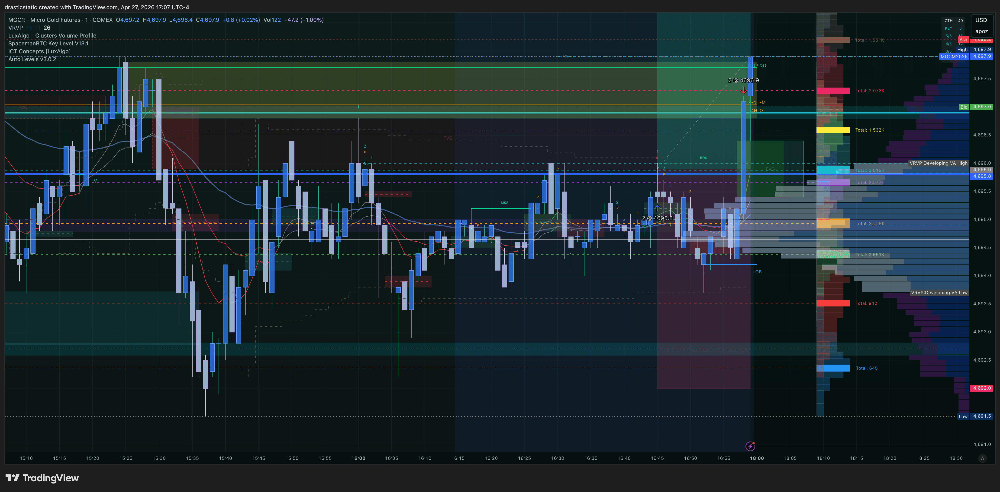
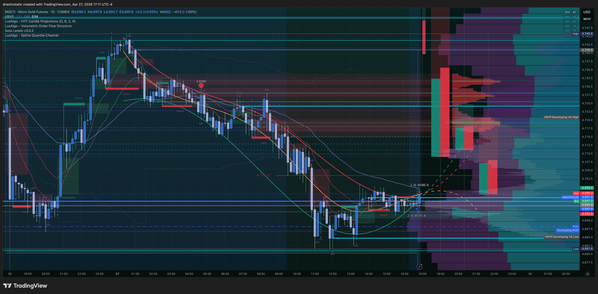
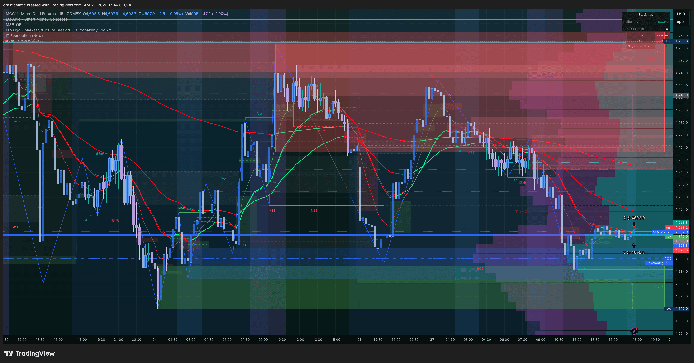

# Trade Review — MGC Long | April 27, 2026
### 20260427_MGC-TPT_001 · Account: TAKEPROFIT558167553 · April 27, 2026

[Jump to 📝 Notes for Coaches ↓](#notes-for-coaches)

---

## ⚡ What Happened in One Paragraph

After a full day of bracket orders across six instruments on TPT — all canceled without a fill — Christopher was approaching the 17:00 ET close with the TPT minimum trading day requirement still unmet. With the account at risk of not counting the day, he stepped outside the plan and executed a near-market buy on MGC at 16:45:49 ET, entering long at 4,695.8 on a 1-micro-contract thesis: a short-term liquidity sweep bounce before continuation, applied via ZTH Bounce playbook. He placed a TP at 4,696.9 just 41 seconds after entry. The trade dipped briefly to a MAE of 4,693.7 (-$42 unrealized) before reversing. The TP filled at 16:58:50 ET — 70 seconds before the platform's hard close — for +$22. The candle that formed at the 18:00 reopen looked like a gravestone doji before continuing higher, validating the short-term read. The result was green, the exit was active, and the day counted.

---

## 📊 Trade Data

| Field | Value |
|-------|-------|
| Account | Tradovate TPT 50K — TAKEPROFIT558167553 |
| Platform | TakeProfitTrader |
| Instrument | MGC (E-Micro Gold) |
| Contract | MGCM6 |
| Direction | Long |
| Entry Price | 4,695.8 |
| Exit Price | 4,696.9 (TP filled) |
| Qty | 2 |
| Entry Time | 16:45:49 EDT |
| Exit Time | 16:58:50 EDT |
| Duration | 13m 1s |
| Order Set | Limit @ 4,696.0 — filled @ 4,695.8 (slight price improvement) |
| Venue | TradingView |
| TP Set / Result | 4,696.9 placed 16:46:30 (41s post-entry) — **filled ✅** |
| SL Set / Result | None — intentionally no SL (market-close trade, natural exit via TP or platform close) |
| MFE | +$28 · +1.4 pts · @4,697.2 |
| MAE | -$42 · -2.1 pts · @4,693.7 |
| Best Exit | +$212 · +10.6 pts · @4,706.4 (18:10 ET — post-close, next session) |
| Gross P&L | +$22 |
| Net P&L | **+$22** |
| Realized R:R | N/A — no SL defined |
| Zella Score | 78.57 |
| Rating | 2.0 / 5 |
| Emotionally Stable | Yes |

---

## 📋 Order Execution

| Time (ET) | Order | Instrument | Price | Status |
|-----------|-------|-----------|-------|--------|
| 04/27 02:04 | Buy Limit | MGC | 4,671.8 | Canceled — overnight bracket entry |
| 04/27 02:04 | Sell Limit | MGC | 4,711.1 | Canceled — overnight bracket TP |
| 04/27 02:04 | Sell Stop | MGC | 4,647.7 | Canceled — overnight bracket SL |
| 04/27 16:23 | Buy Stop | MGC | 4,821.4 | Canceled — bracket hedge |
| 04/27 16:24 | Buy Limit | MGC | 4,691.1 | Canceled — pre-close bracket entry attempt |
| 04/27 16:24 | Sell Limit | MGC | 4,696.9 | Canceled — pre-close bracket TP attempt |
| 04/27 16:28 | Sell Limit | MGC | 4,708.0 | Canceled — bracket TP rebuild |
| 04/27 16:37 | Buy Limit | MGC | 4,683.8 | Canceled — bracket entry rebuild |
| 04/27 16:37 | Sell Stop | MGC | 4,676.0 | Canceled — bracket SL rebuild |
| **16:45:49** | **Buy Limit** | **MGC** | **4,695.8** | **FILLED — ENTRY** (limit set @ 4,696.0) |
| **16:46:30** | **Sell Limit placed** | **MGC** | **4,696.9** | **TP placed 41s post-entry** |
| **16:58:50** | **Sell Limit** | **MGC** | **4,696.9** | **FILLED — TP HIT** |

---

## 📖 Session Narrative

April 27 was the first session of the new week (futures opened Sunday Apr 26 at 18:00 ET) and the first trading day of a critical week for TPT: five minimum trading days required by May 1 to keep the eval alive, with the reset having occurred April 1. Having spent the month focused primarily on APEX, the TPT day count was uncertain — and today needed to register as a trading day.

The session saw brackets placed across at least six instruments — ES, YM, MCL, MGC, GC, NQ — with multiple rebuilds through the day. None filled. As 17:00 ET approached and the day still showed no fills, Christopher made a deliberate decision: step outside the plan, take a conservative near-market entry on MGC to secure the trading day count.

The setup rationale was ZTH Bounce — a short-term liquidity sweep before continuation on a micro contract. Higher timeframe bias was bearish, and the Notes field flags the counter-trend nature explicitly. The entry was a limit order placed at 4,696.0 (current market), filled at 4,695.8. A TP was placed 41 seconds later at 4,696.9. The position briefly dipped to 4,693.7 before reversing. The TP filled at 16:58:50 — 70 seconds before the platform's hard close.

The behavioral note that matters here: this is the first session in many where the exit was not AutoLiq, not prop-firm-forced, not exit passivity — a resting TP was in the book and it filled. That happened on a FOMO trade, which is worth carrying forward: **the exit discipline that's been developing is now available even under pressure.**

No formal pre-market plan on file for this session.

---

## 📸 Screenshot Timeline

**17:07 ET — MGC post-trade chart review**

**17:12 ET — MGC entry zone detail**

**17:14 ET — MGC full context and post-close continuation**

---

## 📝 Notes for Coaches + SmartTraderAI

> "i had to take a trade to honor the min trading days requirement on tpt since focused on apex most of the month and was not filled in my plan so i took a conservative idea at market close, the candle shot up into profit and it felt great to exit with a tp vs prop-firm close exit passivity if even a minute before :-), when market opened again at 18:00 the candle then looked like a gravestone doji only to then continue up again, feels good to have a green day :-)"

This trade is a textbook forced entry — every mistake field Christopher logged is accurate: chasing price, FOMO, not off a level, rushing, counter-trend. The higher-TF bias was bearish, the entry was at market rather than at a structural level, and the motivation was account administration rather than setup quality. A 2.0/5 rating is honest.

And yet: the exit was clean. TP placed 41 seconds post-entry, held through a -$42 MAE, filled at 16:58:50 — 70 seconds before platform close. That is the single most important behavioral data point in this review. Pattern 8 (exit passivity) has been present in some form in every trade since the arc began. This is the first session where the exit was fully active on both a scheduled and an unplanned trade simultaneously — the YM trade (Apr 23) showed it was possible; this trade shows it's repeatable even under emotional pressure.

The "moved TP to be grateful for the win" flag is present, suggesting the TP at 4,696.9 may not have been the original target — or was specifically chosen as a conservative, near-certain exit rather than a structural level. Given the context (market-close trade, no SL, primary goal was green + trading day), that's a reasonable adaptation rather than a Pattern 7 expression. The distinction: moving a TP down due to structural pressure is P7; choosing a conservative TP deliberately at entry is not.

The 10.38% exit efficiency looks harsh but the "best exit" of $212 was reached at 18:10 ET — after the weekly close and into the next session. Comparing an intentional pre-close exit to a price point reached 70 minutes later in a different session is not a meaningful efficiency benchmark for this trade.

**Coaching recommendation:** Acknowledge this trade for what the exit behavior represents, not what the entry represents. The forced entry was a mistake and Christopher knows it. But the TP-in-41-seconds, held-through-MAE, filled-before-close sequence is the exact exit behavior the arc has been building toward. Log it, reinforce it, and let it be the standard going forward — even on trades that don't deserve it.

---

## 🧠 Behavioral Notes

- **Entry emotion:** Anxious, fearful, excited, stressed — forced entry under deadline pressure
- **In-trade emotion:** Brief stress through the -$42 MAE before TP fill
- **Emotionally Stable:** Yes
- **What went right:** TP placed 41 seconds post-entry; held through MAE without canceling the TP; exited before platform close — Pattern 8 not triggered; conservative 2-contract sizing; green day; TPT trading day counted

| Pattern | Status | This Trade |
|---------|--------|-----------|
| Pattern 7 — SL/TP modification | ⚠️ Watch | TP set conservatively at entry (near-certain exit) — not a pressure-driven modification during the trade |
| Pattern 8 — Exit passivity | ✅ Not triggered | TP placed 41s post-entry, held through MAE, filled at 16:58:50 — active exit |
| Pattern 9 — Pre-rest order hygiene | ✅ N/A | Trade closed before market close — no open orders risk |

---

## 🔁 Pattern Tracker

Trade 20260427_MGC-TPT_001 logged.

> See full running progress tracker (all sessions, behavioral arc, compliance scores, statistical summary): [../../pattern_tracker.md](../../pattern_tracker.md)

**Pattern 8 not triggered** — notable. First forced/FOMO entry in the arc where the exit was fully active: TP in the book within 41 seconds, held through adverse move, filled before platform close. Exit discipline is starting to hold even when entry discipline breaks.

---

## 🎯 Forward Focus

1. **The exit habit is real — now protect it.** TP-in-41-seconds on a FOMO trade proves the behavior is available. Apply that same sequence to every planned entry this week: limit order placed → TP placed immediately → walk away.
2. **TPT this week: 4 more minimum trading days by May 1.** Today counts. Prioritize getting fills on planned setups Mon–Thu rather than repeating a market-close forced entry.
3. **Counter-trend entries need a structural level.** The FOMO thesis was a bounce — valid concept, but without a defined level the entry has no reference point. Next time there's a counter-trend read near close, ask: is there a ZTH level within 0.5% of current price? If yes, place a limit and wait. If no, step back.

---

> See full trade review: https://github.com/drasticstatic/trading-assistant-public-preview/blob/main/smarttrader-ai/reviews/2026/04-Apr/review_20260427_MGC-TPT_001.md

---

*Produced with 🙏🏼 Fortuna — Wealth Warden | Claude Code CLI*
*Trade Review — MGC Long · April 27, 2026 · 20260427_MGC-TPT_001*
