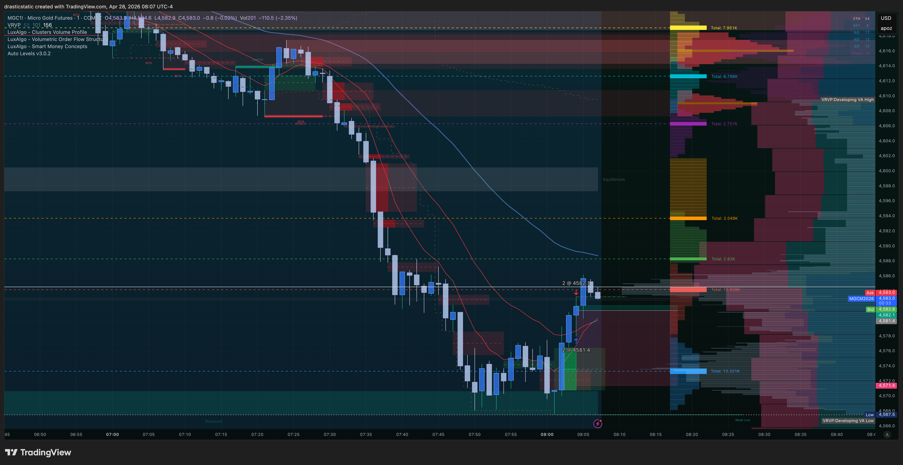
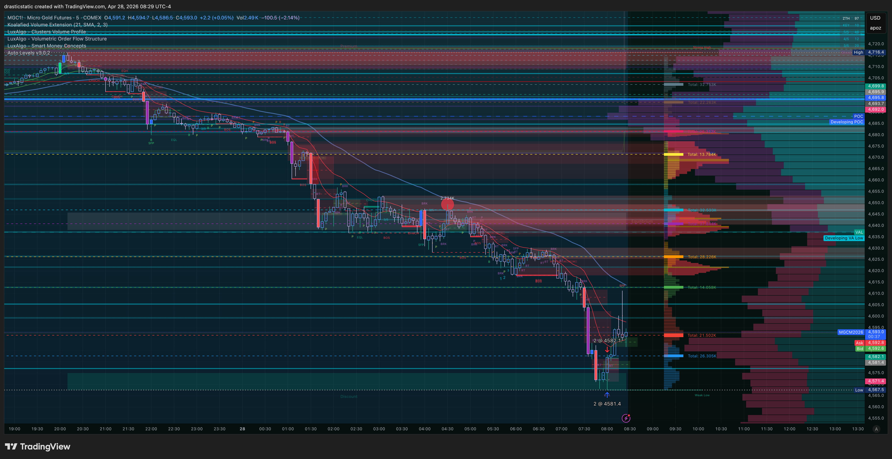
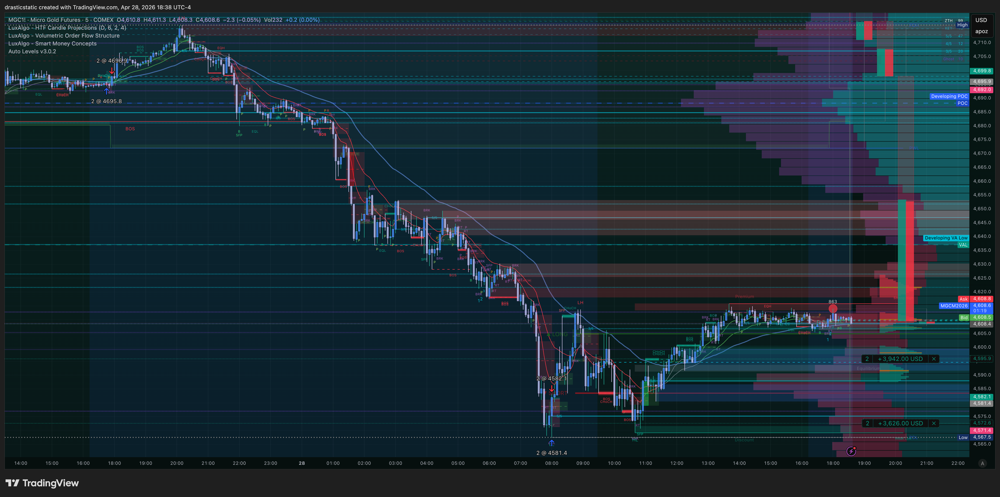

# 🔍 Trade Review — MGC Long · TPT 50K · Tue, Apr 28, 2026
### 20260428_MGC-TPT_001 · +$14.00 · ZTH Bounce · 45s early exit · 2% efficiency

[Jump to 📝 Notes for Coaches ↓](#notes-for-coaches)

---

## ⚡ What Happened in One Paragraph

With TPT reset-3 needing 4 more minimum trading days by May 1, Christopher entered April 28 needing a fill. Gold sold off hard in the AM — a sharp drop from the 4700+ zone to the mid-4570s, with macro volatility driving the move. After cycling through four MGC limit orders between 08:01 and 08:03 (all canceled as price moved), he hit market at 08:04:14 ET, entering long at 4,581.4 on 2 micro contracts — a ZTH Bounce off the AM selloff low. The trade dipped to a MAE of 4,578.0 (-$68) before reversing. At 08:04:59 — just 45 seconds post-entry — he manually flattened at 4,582.1 for +$14, scared out of the position by the initial dip. No TP had been placed. Price continued to recover, reaching 4,615.8 by 13:00 ET — a +$688 potential that went uncaptured. Exit efficiency: 2.03%. Day 2 of 5 for TPT secured; the session then extended into exhaustive bracket-building across multiple instruments through 17:00 ET with no additional fills.

---

## 📊 Trade Data

| Field | Value |
|-------|-------|
| Account | Tradovate TPT 50K — TAKEPROFIT558167553 |
| Platform | TakeProfitTrader |
| Instrument | MGC (E-Micro Gold) |
| Contract | MGCM6 |
| Direction | Long |
| Entry Price | 4,581.4 |
| Exit Price | 4,582.1 (manual market flatten) |
| Qty | 2 |
| Entry Time | 08:04:14 EDT |
| Exit Time | 08:04:59 EDT |
| Duration | 45 seconds |
| Order Set | Market order — 4 limit attempts canceled 08:01–08:03 before market fill |
| Venue | TradingView |
| TP Set / Result | None — no TP placed; manual flatten out of nervousness |
| SL Set / Result | None — not respected; bailed on trade idea |
| MFE | +$36 · +1.8 pts · @4,583.2 |
| MAE | -$68 · -3.4 pts · @4,578.0 |
| Best Exit | +$688 · +34.4 pts · @4,615.8 (13:00 ET) |
| Gross P&L | +$14.00 |
| Net P&L | **+$14.00** |
| Realized R:R | N/A — no SL defined |
| Zella Score | 38.89 |
| Rating | 1.5 / 5 |
| Emotionally Stable | No |

---

## 📋 Order Execution

| Time (ET) | Order | Instrument | Price | Status |
|-----------|-------|-----------|-------|--------|
| 04/28 07:07 | Sell Limit | YM | 49,645 | Canceled — AM bracket TP |
| 04/28 07:07 | Stop | YM | 49,393 | Canceled — AM bracket SL |
| 04/28 07:08 | Buy Limit | YM | 49,467 | Canceled — AM bracket entry |
| 04/28 07:13 | Buy Limit | YM | 49,163 | Suspended |
| 04/28 07:16 | Sell Limit | MCL | 108.21 | Working |
| 04/28 07:19 | Sell Limit | YM | 49,715 | Working |
| 04/28 08:01 | Buy Limit | MGC | 4,570.3 | Canceled — entry attempt |
| 04/28 08:02 | Buy Limit | MGC | 4,340.2 | Canceled — entry attempt (wide) |
| 04/28 08:02 | Sell Limit | MGC | 4,661.3 | Canceled — bracket TP attempt |
| 04/28 08:03 | Sell Limit | MGC | 4,716.2 | Canceled — bracket TP attempt |
| **08:04:14** | **Buy Market** | **MGC** | **4,581.4** | **FILLED — ENTRY** |
| **08:04:59** | **Sell Market (Exit)** | **MGC** | **4,582.1** | **FILLED — MANUAL FLATTEN** |
| 04/28 08:32 | Sell Limit | YM | 49,304 | Suspended — post-trade bracket |
| 04/28 08:32 | Buy Limit | YM | 49,202 | Working — post-trade bracket |
| 04/28 08:37 | Buy Limit | MCL | 99.72 | Canceled |
| 04/28 08:42 | Buy Limit | MGC | 4,525.0 | Suspended — post-trade bracket |
| 04/28 08:42 | Sell Limit | MGC | 4,724.8 | Working — post-trade bracket |
| 04/28 08:49 | Buy Limit | RTY | 2,788.4 | Suspended |
| 04/28 09:09 | Buy Limit | MGC | 4,527.7 | Canceled |
| 04/28 09:09 | Sell Limit | MGC | 4,587.7 | Suspended |
| 04/28 09:27 | Sell Limit | MCL | 104.17 | Canceled |
| 04/28 09:38 | Sell Limit | RTY | 2,806.6 | Working |
| 04/28 09:41 | Buy Limit | MGC | 4,442.1 | Working |

---

## 📖 Session Narrative

April 28 was day two of the TPT reset-3 eval week. With the April 27 trade counting as day 1 of 5, today's session opened with the same pressure — get a fill, count the day, protect the eval cycle with May 1 looming.

Gold entered the AM session in a sharp selloff — a multi-point drop from the 4,710+ zone down toward the high-4,570s. The move is visible on all three screenshots: a sustained red candle sequence through the overnight and into the AM open. The likely driver was continued macro/tariff volatility. The second screenshot (08:29 ET) shows a measured move label ("2 R MMT 1") on the chart, suggesting Christopher had a structural target in mind — 4,615–4,620 zone — before he entered.

Four MGC limit orders were placed and canceled in the 3 minutes before the market fill as price moved rapidly through the levels. At 08:04:14, he hit market at 4,581.4. The thesis was sound — ZTH Bounce, bullish bias on the lower timeframe, support near the AM low. The trade dipped 3.4 points to 4,578.0 (MAE -$68) in the first seconds, then reversed and moved to 4,583.2 (MFE +$36). At 08:04:59 — 45 seconds in, at the first green tick — he flattened manually at 4,582.1 for +$14.

No TP was ever placed.

The afternoon chart (18:38 ET screenshot) shows what the trade could have been: gold continued to recover through the day, reaching 4,615.8 by 13:00 ET — a +$688 potential on the same entry. Christopher then spent the rest of the session building brackets across YM, MCL, MGC, and RTY, none of which filled through the close.

**Market order entry — a barrier crossed.** Both April 27 and April 28 entries were market orders, something Christopher had been reluctant to use despite watching his coaches execute this way routinely — some with mental stops rather than hard orders. Using market orders two sessions in a row represents a psychological shift worth noting: the fear of market fills is giving way to execution confidence, even if the exit discipline around those fills is still developing.

**Post-trade brackets as swing ideas.** The orders placed after the MGC fill — MGC 4,525.0/4,724.8, YM, RTY, MCL — were intentional conservative swing trade ideas on micro contracts, placed without hard SL orders. These reflect active market engagement beyond the morning trade rather than bracket clutter.

His own words: *"reverse of yesterday — initial trade and exhausted myself chasing the market up until 17:00 and continue into the evening hours wishing i could feel like i didn't have to spend 24-7 on the charts."*

---

## 📸 Screenshot Timeline

**08:07 ET — MGC post-trade chart (5-min, entry zone)**

**08:29 ET — MGC wider context with measured move target**

**18:38 ET — MGC end-of-day: full recovery context**

---

## 📝 Notes for Coaches + SmartTraderAI

> "reverse of yesterday - initial trade and exhausted myself chasing the market up until 17:00 and continue into the evening hours wishing i could feel like i didn't have to spend 24-7 on the charts"

Place April 27 and April 28 side by side. Same instrument, same account, same pressure, same playbook.

| | Apr 27 | Apr 28 |
|--|--------|--------|
| Entry | Limit filled @ 4,695.8 | Market hit @ 4,581.4 |
| TP placed? | Yes — 41s post-entry | No |
| MAE | -$42 (-2.1 pts) | -$68 (-3.4 pts) |
| Result | +$22 (TP filled) | +$14 (nervous flatten) |
| Best exit potential | +$212 (post-session) | +$688 (13:00 ET same day) |
| Exit efficiency | 10.38% | 2.03% |
| Emotionally stable | Yes | No |
| Zella score | 78.57 | 38.89 |

The structural difference is one step: placing a TP immediately post-entry. On April 27 Christopher did it. On April 28 he didn't. Everything else — entry quality, thesis, timing — is comparable. The TP is what made April 27 a held trade and April 28 a 45-second nervous scalp.

The 2.03% exit efficiency is a hard number. The trade had $688 on the table by 13:00 ET. He captured $14. The gap is not about market knowledge — the measured move target was already on the chart at 08:29 ET (4,615–4,620). He knew where it was going. The exit was pure emotional override.

One thing to acknowledge separately: two consecutive market order entries. Christopher has noted this was a psychological barrier — something he watched coaches do but had been reluctant to do himself, some of whom use mental stops rather than hard orders. Using market orders on consecutive days is an execution confidence shift worth reinforcing. The fear of market fills is easing. The next step is pairing that execution confidence with immediate TP placement — market in, TP next keystroke.

The note about exhaustion is the most important signal in this review and it is not a trading note — it is a wellbeing note. Watching multiple instruments across a full session, rebuilding brackets that don't fill, carrying the weight of a deadline that resets the eval if missed — this is the environment where impulsive exits happen and where the work Christopher has done on his process gets eroded not by bad analysis but by fatigue. Staying at the desk from 08:00 through 17:00 and into the evening looking for fills that never came is a different kind of discipline problem than moving a stop. It is the front-end of the pattern.

**Coaching recommendation:** The trade review for the entry is clear — market entry, no TP, scared out at first green tick. The coaching work is upstream of the trade. Christopher needs a session boundary — a defined window where he is at the desk and focused, and a defined time when the screen goes off regardless of fills. The exhaustion he described is the condition that produces 2.03% exit efficiency. Fix the container, and the exits will follow.

---

## 🧠 Behavioral Notes

- **Entry emotion:** Anxious, confident, fearful, frustrated, stressed
- **In-trade emotion:** Fear — manual flatten at first green tick, 45 seconds in
- **Emotionally Stable:** No
- **What went right:** Entry near AM low; correct directional read; day 2/5 counted; accepted the result; journaled; used market order execution (barrier crossed — coaches do this routinely); post-trade swing brackets placed intentionally across multiple instruments

| Pattern | Status | This Trade |
|---------|--------|-----------|
| Pattern 7 — SL/TP modification | ⚠️ Active | No TP placed; manual early exit = equivalent effect to a TP moved all the way to entry |
| Pattern 8 — Exit passivity | ⚠️ Watch | Exit was active but premature — impulsive flatten vs resting TP; $688 left uncaptured |
| Pattern 9 — Pre-rest order hygiene | ⚠️ Active | Post-trade brackets across 4 instruments — confirm all closed before stepping away |

---

## 🔁 Pattern Tracker

Trade 20260428_MGC-TPT_001 logged.

> See full running progress tracker (all sessions, behavioral arc, compliance scores, statistical summary): [../../pattern_tracker.md](../../pattern_tracker.md)

Two forced entries back-to-back on TPT. The exit behavior contrast is the clearest data point in the arc since Pattern 8 was identified: April 27 had a TP and captured $22. April 28 had no TP and captured 2.03% of the available move. The variable is the TP. The exhaustion note flags that session structure — not just order structure — is now part of the coaching picture.

---

## 🎯 Forward Focus

1. **TP first, always — before anything else.** Entry filled → TP placed → hands off the keyboard. Not when it feels right. Not after watching a few ticks. Immediately. April 27 proved it works. April 28 proved the cost of skipping it.
2. **Define a session window and honor it.** Set a start time, set an end time, close the screen at the end time. Brackets can stay live. The exhaustion in today's notes is what kills exit discipline — protect the container first.
3. **TPT: 3 days remaining by May 1 (Tue, Wed, Thu).** Two secured. Planned bracket entries only — avoid a third consecutive market-order forced fill.

---

> See full trade review: https://github.com/drasticstatic/trading-assistant-public-preview/blob/main/smarttrader-ai/reviews/2026/04-Apr/review_20260428_MGC-TPT_001.md

---

*Produced with 🙏🏼 Fortuna — Wealth Warden | Claude Code CLI*
*Trade Review — MGC Long · April 28, 2026 · 20260428_MGC-TPT_001*
