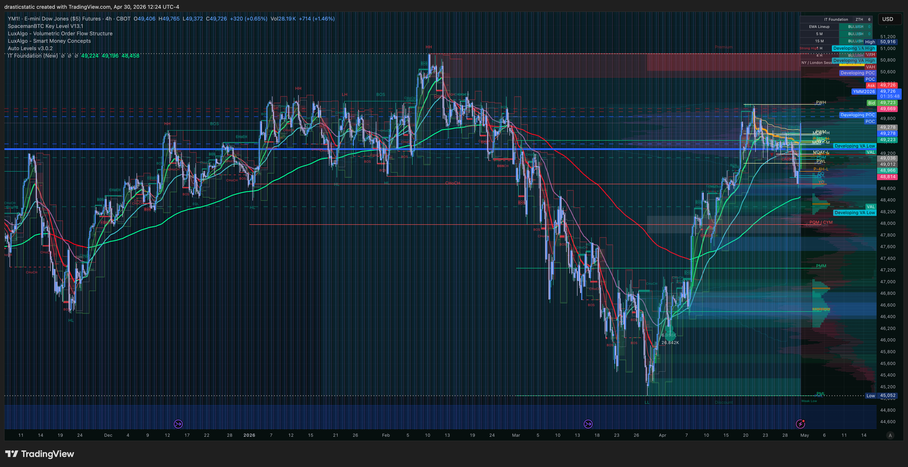
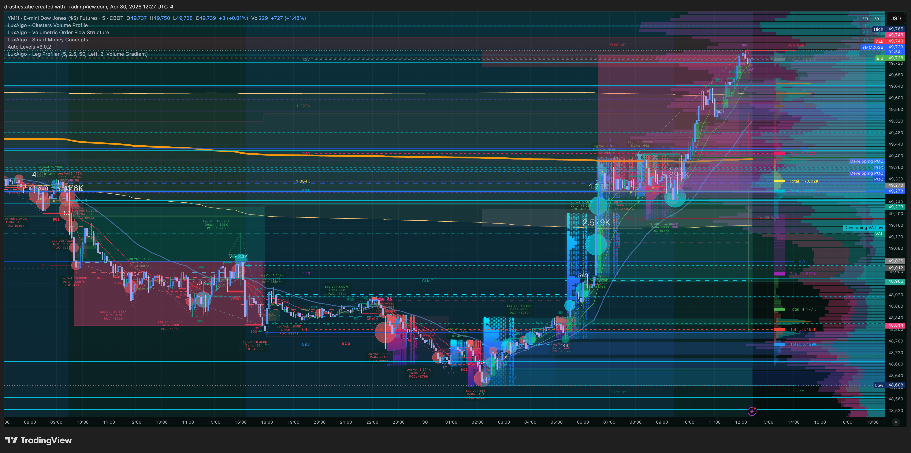

# 🔍 Trade Review — YM Short · TPT 50K · Thu, Apr 30, 2026
### 20260430_YM-TPT_001 · -$2,000.00 · AutoLiq · No SL · Account blown
### Pattern 7 — no stop set; SMT divergence against thesis

[Jump to 📝 Notes for Coaches ↓](#notes-for-coaches)

---

## ⚡ What Happened in One Paragraph

A resting SHORT limit on YM at 49278 was placed the evening of April 29 and filled pre-market on April 30 at 06:38 EDT. No stop loss was set at entry or after fill — a deliberate choice at the time, with the intention of setting one once the position was established. That intention was not acted on.

During the NY session, YM moved aggressively upward — diverging sharply from NQ (+0.07%) and ES (+0.37%) while YM printed +1.20% and RTY +0.99%. SMT divergence was against the short thesis: Dow and small-caps leading while NASDAQ lagged is a value-rotation signal, not a short-YM setup. The coach confirmed this read live — noting PWL SMT bullishness on YM and watching for a potential break of the prior YM high to signal NQ longs.

With no stop in place and price moving 400+ points against the entry, the account hit the TPT minimum balance floor. AutoLiq triggered at 49678 at 11:50 EDT. Net loss approximately −$2,000. TPT reset-3 account blown.

---

## 📊 Trade Data

| Field | Value |
|-------|-------|
| Account | TPT 50K reset-3 — TAKEPROFIT558167553 |
| Symbol | YM (E-mini Dow Jones) |
| Side | SHORT |
| Entry Price | 49,278.0 |
| Exit Price | 49,678.0 |
| Quantity | 1 contract |
| Points | −400 |
| Gross P&L | **~−$2,000.00** |
| Net P&L | **~−$2,000.00** |
| Open | Apr 30, 06:38:45 EDT (resting limit placed Apr 29, 18:17 EDT) |
| Close | Apr 30, 11:50:58 EDT (AutoLiq — Market order) |
| Duration | ~5h 12m |
| MAE | −$2,000 (AutoLiq at floor) |
| MFE | Unknown — no screenshots captured |
| MAE | -$2,370 (Price: 49,752 — exceeded AutoLiq level) |
| MFE | +$470 (Price: 49,184 — ~09:00 ET) |
| Best Exit | $470 at 49,184 at 09:00 ET |
| Exit Efficiency | n/a (AutoLiq) |
| Zella Score | **-84.39** |
| Rating | 0.5 / 5 |
| Playbook | ZTH \| Pivot |
| Setups | Anticipated retracement |
| Bias | Switched on lower TF — larger consolidation range |
| Stop Loss | ⚠️ Not set — auto-liquidated at drawdown threshold |
| Emotions | Ambivalent · fearful · frustrated · greedy · stressed |
| Mistakes | No stop loss · stayed too long · ignored recent bias · refused to accept and close the losing position · underestimated the market's ability to keep going · fear of loss |
| What I Did Well | Calculated liquidation threshold for awareness · committed to plan · journaled · realized trade was moving opposite direction |
| Notes for Coaches | "I was hopeful for at least some sort of reversal to exit but none of my less-than-best TPs would have hit anyway and I was struggling to accept exiting with a market order. I don't know why I lean into reversals thinking it is less risky — I am scared of tighter stop losses and continuation trades but that's better than when I allow this to happen. I wonder how I would operate if I didn't feel like I had to rush to meet the 30-day clock and needing this to work to survive." |

---

## 📋 Order Execution

- Entry: resting SELL limit at 49278 placed Apr 29 18:17 EDT; filled Apr 30 06:38:45 EDT
- No stop loss placed at or after fill
- No manual exit attempted
- Exit: AutoLiq Market order at 49678, Apr 30 11:50:58 EDT
- Account reached TPT minimum balance floor → immediate liquidation

---

## 📖 Session Narrative

The YM short at 49278 was placed as a resting overnight limit on April 29 evening — a conservative entry level relative to where YM was trading. It filled in pre-market on April 30 at 06:38 EDT.

The Apr 30 session opened with a notable index divergence: YM and RTY were moving up strongly while NQ barely moved (+0.07%). This is the opposite of a typical risk-on broad rally — it signals sector rotation into Dow/small-cap value names away from NASDAQ growth. The SMT setup did not support the YM short thesis. The coach noted this live, flagging PWL SMT bullishness on YM and considering a potential NQ long if YM broke the prior high.

With no stop in place, the position held through the entire adverse move. No exit decision was made. At 11:50 EDT, YM reached the level that put the account at its minimum balance floor — TPT's real-time liquidation mechanism triggered, and the position was auto-closed at 49678 for −400 points, approximately −$2,000. TPT reset-3 account closed.

APEX-06 was not involved in this session. Following the TPT blow, the RTY idea was moved to APEX-06 with a more conservative approach — the YM result sharpened awareness of how quickly an unprotected position can exhaust account cushion.

A wider session note: Christopher was watching multiple instruments simultaneously with resting orders spread across YM, RTY, ES, MCL, and MGC. The formal premarket plan shifts when live — the overall structural bias holds but the specific level and instrument targets evolve in real time. This is not necessarily a flaw; the ability to read the live session and adjust is part of the framework. The gap is in translating that live awareness into protected, documented setups rather than uncovered resting limits.

---

## 📸 Screenshot Timeline

**12:24 ET — YM post-AutoLiq: price structure at liquidation zone**

**12:27 ET — YM broader context: full session move**

---

## 📝 Notes for Coaches + SmartTraderAI

YM short entered via resting overnight limit at 49278, filled pre-market Apr 30. No stop loss set. The session opened with SMT divergence against the short: YM +1.20%, RTY +0.99% while NQ +0.07% and ES +0.37% — Dow/small-caps leading NASDAQ is a value-rotation signal, not a short-YM context. Coach confirmed PWL SMT bullishness on YM live. No exit action taken through the adverse move. TPT AutoLiq triggered at 49678 (−400 pts, ~−$2,000) when account hit the minimum balance floor. TPT reset-3 account blown. Pattern 7 (no stop) was the direct cause of account loss — without a defined stop the position had no floor below the account floor itself.

---

## 🧠 Behavioral Notes

**The stop was not set.** That is the full story of how the account blew. A 400-point adverse move on YM with no mechanical stop is exactly how a prop firm account ends. The intention to set one after the fill is a pattern — it has appeared in session notes before. Intention is not protection. The stop has to be placed before or immediately at fill, not scheduled for "when the position is established."

**The SMT picture was against the thesis from the open.** YM leading at +1.20% while NQ barely moves is not a short-YM session. The read was available — the coach named it live. The trade could have been exited at a much smaller loss if the divergence signal had been acted on.

**Under pressure, the habits take over.** Christopher acknowledged this directly during the session. The observation is important: when stress is present, the trained reflex activates — and the trained reflex right now is to hold without a stop and wait for resolution. That reflex is the thing being retrained. Awareness of it in the moment is step one. Acting differently is step two. Today was step one.

**The account blow does not affect APEX-06.** That account remains active and the profit target is still open. The firewall held.

---

## 🔁 Pattern Tracker

| Pattern | Status |
|---------|--------|
| Pattern 7 — SL modification | 🔴 **Active** — no stop set; account floor became the de facto stop |
| Pattern 8 — Exit passivity | 🔴 Active — no manual exit attempt through 400-point adverse move |
| Pattern 9 — Pre-rest order hygiene | 🔴 Adjacent — resting limit left live overnight without corresponding stop |
| SMT divergence ignored | 🔴 Flagged — YM/RTY leading vs NQ flat is a signal to re-evaluate, not hold |
| Account blown | 🔴 TPT reset-3 — TAKEPROFIT558167553 closed Apr 30, 2026 |

> See pattern tracker: [../../pattern_tracker.md](../../pattern_tracker.md)

---

## 🎯 Forward Focus

1. **Stop loss is non-negotiable before any fill.** Resting limits especially — a limit that fills overnight or pre-market while you're away from the desk has zero protection without a corresponding stop. If the stop cannot be set simultaneously, the limit should not be placed.
2. **SMT divergence against your thesis is an exit signal.** YM leading at 3x the rate of NQ is not noise — it is information. Coaches flagged it in real time. Next time the SMT picture inverts on an open position, that is the cue to assess exit, not hold.
3. **APEX-06 is the priority.** TPT reset-3 is gone. APEX-06 is alive with the profit target still open. All attention and discipline goes there.

---

> See full trade review: https://github.com/drasticstatic/trading-assistant-public-preview/blob/main/smarttrader-ai/reviews/2026/04-Apr/review_20260430_YM-TPT_001.md

*Produced with 🙏🏼 Fortuna — Wealth Warden | Claude Code CLI*
*Account: TPT 50K reset-3 — TAKEPROFIT558167553 · Account closed Apr 30, 2026*
