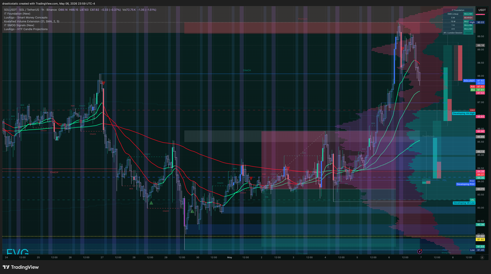
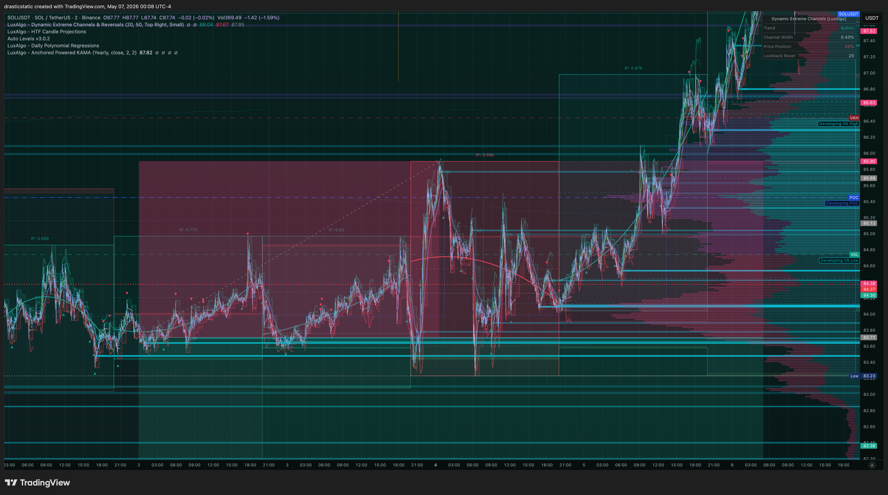
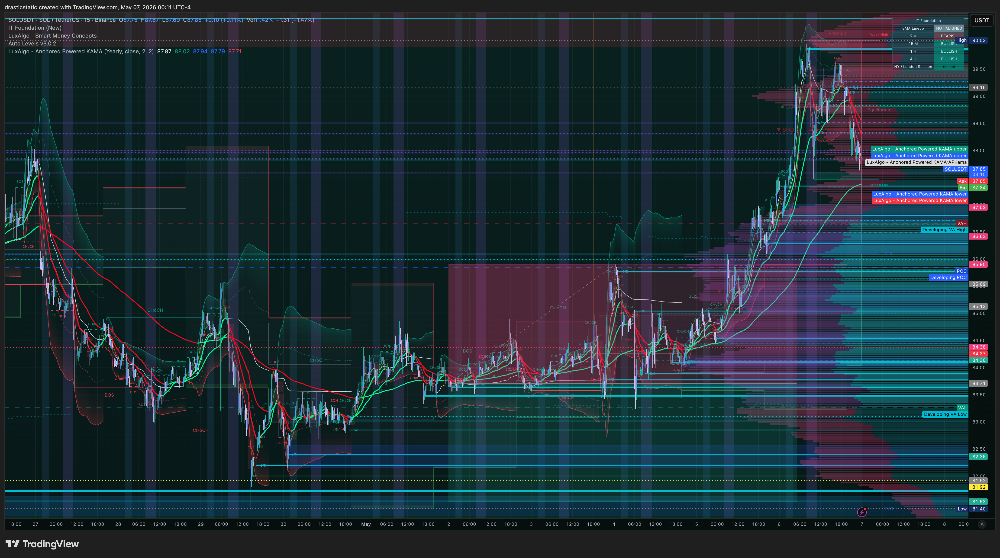
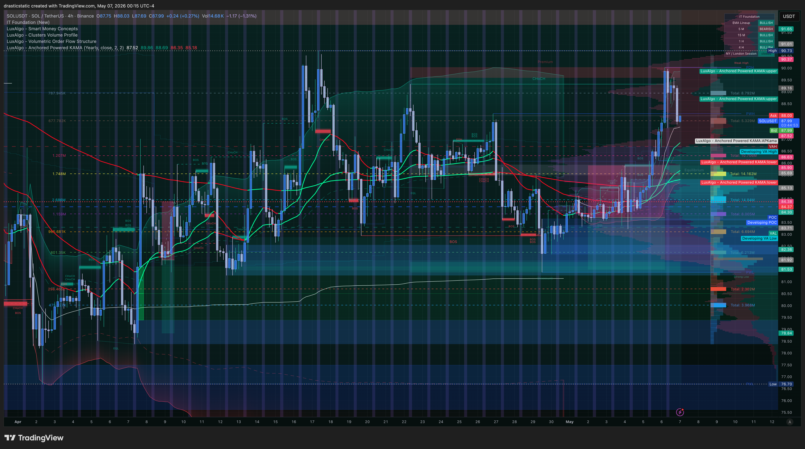

# 🔍 Trade Review — SOL Short · BTCC · ~May 2–6, 2026
### 20260502_SOL-BTCC_001 · P&L unknown · Liquidated — insufficient margin
### ⚠️ Partial review — no BTCC CSV (2FA phone unavailable); screenshots only

[Jump to 📝 Notes for Coaches ↓](#notes-for-coaches)

---

> **Data status:** This review is partial. BTCC 2FA requires phone access that was unavailable during this period. Entry price, exit price, exact P&L, and TradeZella metrics are not available. The review is built from screenshots and session context only. Update when BTCC account access is restored.

---

## ⚡ What Happened in One Paragraph

Christopher entered a SOL/USDT short on BTCC (voucher trade) around May 2, establishing a bearish position against what appeared to be a weakened SOL structure. The short held through the first half of the week. Then on May 5–6, a major macro catalyst — US-China tariff relief and CPI data — triggered one of the sharpest crypto rallies of 2026. SOL surged dramatically against the position. With no stop loss (voucher trade conventions don't require mechanically set stops) and insufficient margin to absorb the spike, BTCC liquidated the position automatically around May 6. The screenshots taken at ~midnight May 6–7 ET capture the moment of review: a massive green candle visible on the SOL chart, Christopher looking at the liquidation in real time. The result was a loss — amount unknown without BTCC CSV access. Pattern 8 and the absence of a stop loss were both structural contributors.

---

## 📊 Trade Data

| Field | Value |
|-------|-------|
| Account | BTCC Voucher |
| Platform | BTCC Crypto Exchange |
| Instrument | SOL/USDT |
| Direction | Short |
| Entry Price | Unknown — BTCC CSV unavailable |
| Exit Price | Unknown — liquidated (insufficient margin) |
| Entry Date | ~May 2, 2026 (approx.) |
| Exit Date | ~May 6, 2026 |
| Duration | ~4–5 days |
| Qty | Unknown |
| TP Set | Unknown |
| SL Set | None (voucher trade) |
| MFE | Unknown |
| MAE | Unknown — sufficient to trigger liquidation |
| Gross P&L | **Unknown** |
| Net P&L | **Unknown — loss (liquidation)** |
| Exit Efficiency | N/A |
| Zella Score | Not available |
| Rating | Not available |

> Update this table when BTCC account access is restored with phone 2FA.

---

## 📋 Order Execution

Order execution data unavailable — BTCC CSV requires 2FA to export.

---

## 📖 Session Narrative

SOL entered a bearish structure earlier in the week of April 28 – May 2. The short was established as a voucher trade on BTCC, consistent with the pattern of using BTCC vouchers for crypto directional plays. Based on prior BTCC entries, no hard stop loss is typically placed on voucher trades — the voucher absorbs the loss to a floor, but margin liquidation is the backstop rather than a mechanical stop order.

The macro event that ended this trade was significant. In the first week of May 2026, news of a US-China tariff pause (or de-escalation) combined with a favorable CPI print triggered a broad risk-on rally. Crypto was among the hardest-moving asset classes. SOL surged in a single candle structure that overwhelmed the short's remaining margin buffer. The liquidation was not a slow grind — the screenshots show a near-vertical move.

The screenshots captured at ~midnight ET on May 6–7 show Christopher reviewing the chart in real time as the liquidation occurred or immediately after. The four SOL charts document the move from multiple timeframes and analytical lenses: the full-context daily view showing the macro spike, and the detailed indicator view showing the EMA/Fibonacci structure that the trade was based on.

This trade fits the established BTCC voucher arc: a directional thesis with reasonable structural basis, held without a stop, liquidated by a macro event that overrode the technical read. Prior examples: Apr 8 SOL SHORT (~-$22, AutoLiq on tariff deadline), Mar 25–26 SOL LONG (-$14.13, manual exit below entry after pattern exhaustion). The macro risk during this period was elevated — US-China trade war developments were creating sharp, unpredictable moves weekly.

> Pre-market plan: No formal premarket file found for this period.

---

## 📸 Screenshot Timeline

Screenshots taken May 6 23:59 – May 7 00:15 ET — at or immediately after liquidation.

**May 6, 23:59 ET — SOL daily context: the macro spike that liquidated the short**

**May 7, 00:08 ET — SOL structure: EMA ribbon, Fibonacci regression, and trade context**

**May 7, 00:11 ET — SOL detail: entry zone and spike context**

**May 7, 00:15 ET — SOL overview: full move scope from entry to liquidation**

---

## 📝 Notes for Coaches + SmartTraderAI

This review is limited by data availability and should be updated when BTCC access is restored. The coaching observations below are based on pattern context and screenshots.

**On macro risk and crypto shorts.** The tariff/CPI event that liquidated this trade was a known risk category — macro news events create outsized moves in crypto. Holding a short without a stop through a week that included active US-China trade negotiations was accepting unbounded gap risk. This is distinct from Pattern 8 (which is about exit passivity on profitable trades) — this is structural position risk management. A voucher trade without a stop during an elevated macro risk week is a single-event liquidation waiting to happen.

**On the BTCC voucher framework.** The voucher trading model has appeared repeatedly in this arc: Apr 8, Mar 25–26, now May 2–6. Each time, the absence of a mechanical stop is a feature of the voucher, not of Christopher's exit discipline. But the result — liquidation when the trade goes wrong — is functionally identical to a blown stop. The question worth examining: what would change if a manual stop order were placed even on voucher trades, independent of the voucher's floor protection? The answer is earlier exits with less damage, even if the voucher would have covered it.

**On the emotional context.** This liquidation happened in the same week as the two RTY trades. Three positions held across different instruments, all exiting via involuntary mechanisms (AutoLiq for RTY × 2, liquidation for SOL). The week's P&L in futures was positive ($360 + $700 = +$1,060). The crypto column was a loss. The psychological weight of watching three consecutive positions close without a deliberate voluntary exit — on top of the pre-existing legal and financial stress of this period — deserves acknowledgment.

---

## 🧠 Behavioral Notes

**Emissions available:** Not available (no TradeZella data)  
**Emotionally stable:** Unknown  

**Pattern status:**

| Pattern | Status | This Trade |
|---------|--------|------------|
| Pattern 7 (SL modification) | Not applicable — no SL to modify | No SL set (voucher) |
| **Pattern 8 (exit passivity)** | 🔴 Active — probable | No voluntary exit before liquidation |
| Pattern 9 (pre-rest order hygiene) | 🔴 Active | No protective order before multi-day hold |

**What went right:**
- Trade was documented (screenshots taken at liquidation)
- No futures account was touched — BTCC voucher contains the risk
- Continued journaling through a painful week

---

## 🔁 Pattern Tracker

Trade 20260502_SOL-BTCC_001 logged (partial — pending BTCC CSV import).

> See full running progress tracker (all sessions, behavioral arc, compliance scores, statistical summary): [../../pattern_tracker.md](../../pattern_tracker.md)

Third consecutive involuntary exit across three positions this week. BTCC arc continues: voucher short → macro event → liquidation. When BTCC 2FA is restored, update Trade Data table and Running P&L with exact figures.

---

## 🎯 Forward Focus

1. **Macro risk weeks require a stop on every position, including vouchers.** Before entering any trade in a week with scheduled major macro events (FOMC, CPI, trade war negotiations), define a max-loss price and place the order. The voucher floor does not protect against the emotional and capital cost of liquidation.
2. **When BTCC access is restored** — export the trade CSV, update this review's Trade Data table, and run the TradeZella import. The data matters for accurate pattern tracking.
3. **Three involuntary exits in one week is the signal.** This is not three separate events — it's one pattern showing up in every instrument. The single behavioral target for next week: make one voluntary exit decision before any hard close or liquidation fires.

---

> See full trade review: https://github.com/drasticstatic/trading-assistant-public-preview/blob/main/smarttrader-ai/reviews/2026/05-May/review_20260502_SOL-BTCC_001.md

---

*Produced with 🙏🏼 Fortuna — Wealth Warden | Claude Code CLI*
*Trade Review — SOL Short · ~May 2–6, 2026 · 20260502_SOL-BTCC_001*
*⚠️ Partial — update when BTCC 2FA access restored*
