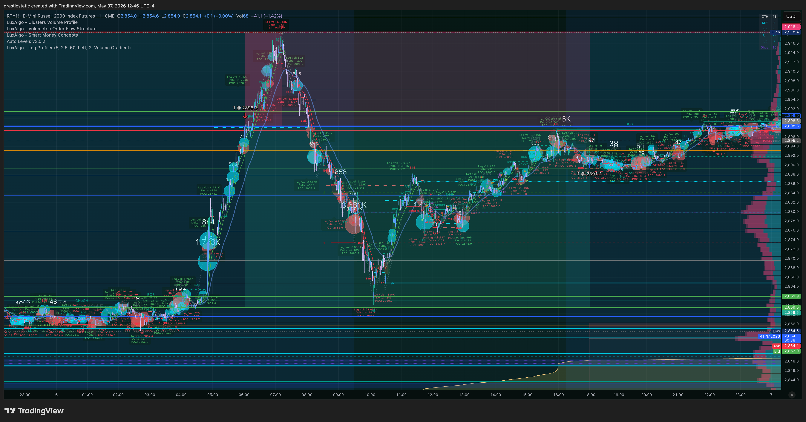
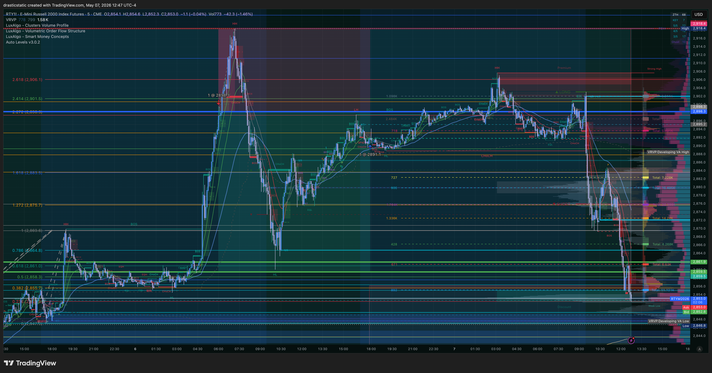
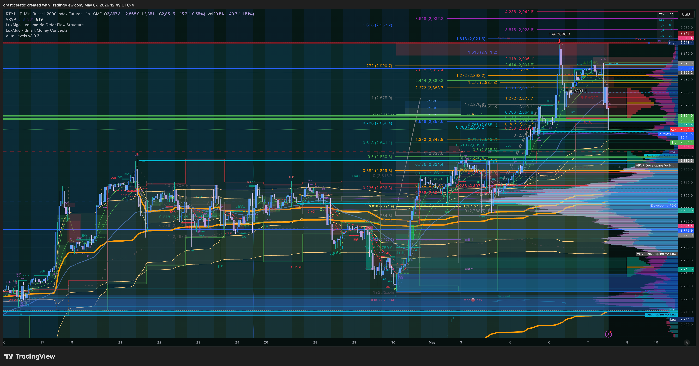

# 🔍 Trade Review — RTY Short · APEX-06 · Tue, May 6, 2026
### 20260506_RTY-APEX_001 · +$360 · AutoLiq exit · Zella 18.85
### Pattern 8 confirmed — TP within 0.2 pts of the low, then canceled

[Jump to 📝 Notes for Coaches ↓](#notes-for-coaches)

---

## ⚡ What Happened in One Paragraph

Christopher entered RTY short via a pre-market limit order at 2898.3, filled at 06:02 EDT — part of a broader overnight setup that included canceled orders on YM and MCL. The entry logic was Fibonacci projections on what appeared to be an exhausted uptrend with a ZTH Pivot at the 2900 area, though TradeZella acknowledged it was FOMO-driven ("feeling the runway disappearing"). Price moved in favor almost immediately: RTY reached its intraday low of 2860.1 around 10:00 EDT, which came within 0.2 points of a resting TP Christopher had placed at 2861.9. He then canceled that TP at 14:45 EDT, holding for a deeper move. No SL was in place at any point. Price recovered through the afternoon and Apex's hard close AutoLiquidated the position at 2891.1 at 16:59 EDT, realizing +$360 of a $1,910 MFE — 18.85% exit efficiency. Christopher described himself as "so hard on myself internally" afterward and did not want to look at a chart for several days.

---

## 📊 Trade Data

| Field | Value |
|-------|-------|
| Account | APEX-484839-06 |
| Platform | Apex Trader Funding 100K |
| Instrument | RTY — E-mini Russell 2000 |
| Contract | RTYM6 |
| Direction | Short |
| Entry Price | 2898.3 |
| Exit Price | 2891.1 |
| Qty | 1 contract |
| Entry Time | 06:02:00 EDT, Tue May 6, 2026 |
| Exit Time | 16:59:04 EDT, Tue May 6, 2026 |
| Duration | 10h 57m (39,424 sec) |
| Order Set | Pre-market limit — placed overnight via TradingView |
| Venue (Entry) | TradingView (Limit) |
| Venue (Exit) | AutoLiq (Market) |
| TP Set | 2861.9 — placed at entry, **canceled 14:45 EDT** |
| SL Set | None |
| MFE | 2860.1 · 38.2 pts · **+$1,910** |
| MAE | 2918.4 · -20.1 pts · **-$1,005** |
| Gross P&L | **+$360.00** |
| Net P&L | **+$360.00** |
| Exit Efficiency | 18.85% |
| Realized R:R | N/A (no SL defined) |
| Zella Score | 18.85 |
| Rating | 3.5 / 5 |
| Emotionally Stable | No |

---

## 📋 Order Execution

| Time (EDT) | Order | Instrument | Price | Status |
|------------|-------|------------|-------|--------|
| May 5, 18:09 | BUY Limit | YMM6 | 49,816 | Canceled |
| May 6, 04:17 | BUY Limit (qty 2) | MCLM6 | 62.71 | Canceled |
| May 6, 04:17 | SELL Limit (qty 2) | MCLM6 | 72.33 | Canceled |
| May 6, 05:28 | SELL Limit | YMM6 | 50,643 | Canceled |
| **May 6, 06:02** | **SELL Limit** | **RTYM6** | **2898.3** | **Filled — entry** |
| May 6, 14:45 | BUY Limit | RTYM6 | 2861.9 | **Canceled** ← TP removed 4h after MFE |
| **May 6, 16:59** | **BUY Market** | **RTYM6** | **2891.1** | **Filled — AutoLiq exit** |

> The TP at 2861.9 was placed at entry and came within **0.2 points** of the intraday low (2860.1 at ~10:00 EDT). It was then canceled at 14:45 EDT — four hours after the optimal exit window had already passed. No SL was set for the entire 10h 57m hold.

---

## 📖 Session Narrative

Tuesday May 6 — pre-market hours. The broader tape had been running hard into resistance near the 2900 area on RTY. The overnight session saw multiple orders placed and canceled: YM long from the previous evening, MCL entries in the early morning. By the time the RTY short limit filled at 06:02, Christopher had clearly been watching the overnight session actively and constructing a bearish thesis around the 2900 structural zone.

The Fibonacci projections he cited are visible in the third screenshot (12:49 ET, taken day-after for review) — targets projected from the swing high down toward the 2860–2830 range. The setup was not without logic. RTY did reject from 2900, move into the Fibonacci zone, and reach the projected level at 2860. The trade read was correct.

The failure was entirely in execution. At 10:00 EDT, the TP was 0.2 points from being triggered. Price was at the projected level. At that moment — at the exact moment the trade thesis played out — the TP was left in place. Then, as price consolidated and slowly recovered through the mid-morning, doubt crept in. The TP was canceled at 14:45 with the aim to "trail beyond local low." By that point the low was already four hours old. The exit shifted from active to passive, and the AutoLiq at 16:59 resolved what a voluntary exit would have resolved near 10:00 AM.

The MAE of $1,005 (-20.1 pts to 2918.4) is worth noting — the trade went against by nearly $1,000 at some point, with no SL in place. The emotional weight described afterward ("didn't want to look at a chart for a while") likely includes this: the risk was real, the profit was real, and the behavioral miss was real all in the same session.

> Pre-market plan: No formal premarket file found for May 6.

---

## 📸 Screenshot Timeline

Screenshots taken May 7 during post-close review.

**May 7, 12:46 ET — RTY hourly context: entry at 2898, decline, and recovery**

**May 7, 12:47 ET — RTY macro structure: HTF levels and swing context**

**May 7, 12:49 ET — Fibonacci projections: entry logic and downside targets**

---

## 📝 Notes for Coaches + SmartTraderAI

> "i was so hard on myself internally for this one and did not even want to look at a chart afterward for a while"

The self-criticism is understandable. But coaches should know: the trade read was right, the TP was placed almost exactly at the low, and the entry was structured (pre-market limit, not a reactive market order). This was not a failed trade — it was a correctly-read trade with one exit decision that destroyed the result.

**The TP cancellation is the story of this review.** At 14:45 EDT, with the session low already behind him by four hours, Christopher removed the resting exit order that was 0.2 points from being filled at peak. The removal happened during the recovery phase — when price had already bounced from the low and the urgency to exit had faded. This is Pattern 8 at its most instructive: the exit plan was present and nearly triggered, but the conviction to keep it in place collapsed as the optimal window passed.

**A note on what "set an exit vs exit passivity" means here.** Christopher listed this in the TradeZella "what I did well" column. He did place a TP, which counts as exit planning — but the exit was ultimately via AutoLiq. The distinction matters: planning an exit and executing an exit are not the same thing. This self-assessment deserves gentle challenge in coach review.

**The missed capture: $1,550.** Of the $1,910 available at MFE, only $360 was captured. Had the TP been left in place, the trade would have been a 4+R result (no SL defined, but relative to the $1,005 MAE risk, a +$1,910 exit represents a strong capture ratio). Instead: 18.85%.

**Coaching recommendation — single rule:** Once a resting TP is placed and price is within 10% of the target, it cannot be canceled unless price has structurally invalidated the original thesis (not because you expect more). Test this rule explicitly on the next RTY trade.

---

## 🧠 Behavioral Notes

**Emotions:** Angry · excited · frustrated · greedy · stressed · anxious · ambivalent · fearful  
**Emotionally stable:** No  
**Entry driver:** "Fear of missing out, feeling the runway disappearing, Fibonacci projections" — FOMO with a structural rationale layered on top.

**Pattern status:**

| Pattern | Status | This Trade |
|---------|--------|------------|
| Pattern 7 (SL modification) | Not applicable — no SL set | No SL placed at any point |
| **Pattern 8 (exit passivity)** | 🔴 Active | TP canceled 4h after MFE; AutoLiq exit |
| Pattern 9 (pre-rest order hygiene) | 🟡 Partial | TP placed initially; removed mid-session; no SL ever |

**What went right:**
- Directional read was correct (RTY did reject 2900 and reach the projected Fib target)
- Pre-market limit entry — not a reactive market order at open
- TP was placed at entry (intent to exit was present at the start)
- TradeZella journaled same-day despite the emotional weight
- Multiple canceled setups (YM, MCL) show awareness of other instruments before committing

---

## 🔁 Pattern Tracker

Trade 20260506_RTY-APEX_001 logged.

> See full running progress tracker (all sessions, behavioral arc, compliance scores, statistical summary): [../../pattern_tracker.md](../../pattern_tracker.md)

Pattern 8 continues. The specific form here: TP placed near-exactly at the eventual low, canceled during the recovery phase, followed by passive hold to AutoLiq. The exit plan was not absent — it was actively removed. This makes the behavioral note more actionable than "failed to exit": the trigger was there and the decision was made to take it away.

---

## 🎯 Forward Focus

1. **TP within 10% of target = non-cancelable.** The rule is simple: once a resting TP is set and price has closed within 10% of the target, it stays. If you want to trail lower, do it by moving the TP tighter — never by removing it.
2. **No SL = no trade.** This is the second RTY trade in the recent arc with a multi-hour hold and no stop. An overnight limit short needs a defined SL placed at fill, before you step away. Define the maximum risk in ticks before the order is set.
3. **Reframe the self-assessment.** The direction was right. The TP was right. The result reflects one decision, not the whole session. Write one sentence in TradeZella after the next trade: "I left the TP in place."

---

> See full trade review: https://github.com/drasticstatic/trading-assistant-public-preview/blob/main/smarttrader-ai/reviews/2026/05-May/review_20260506_RTY-APEX_001.md

---

*Produced with 🙏🏼 Fortuna — Wealth Warden | Claude Code CLI*
*Trade Review — RTY Short · May 6, 2026 · 20260506_RTY-APEX_001*
